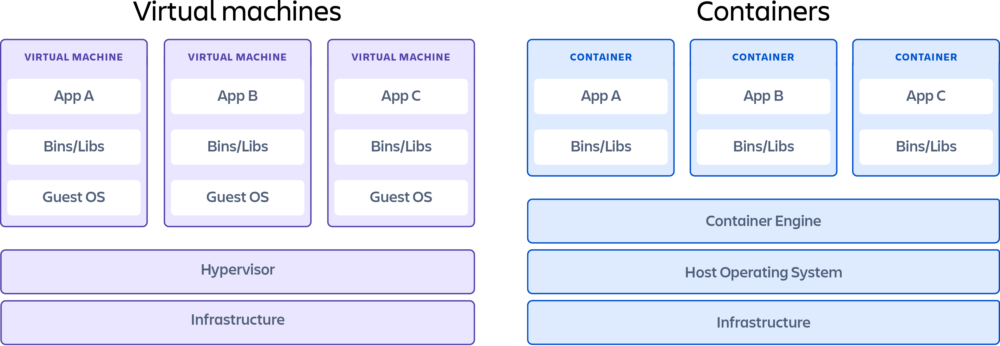

<aside>
💡

어떤 문제를 해결하기 위해 vm과 docker가 생성되었고, 어떤 특징을 가지는지 알아보며 장단점을 보자

</aside>

# Docker란?

**Docker**는 **컨테이너**를 사용해 응용 프로그램을 분리된 환경에서 실행, 관리할 수 있게 하는 오픈소스 가상화 플랫폼이다.

## 도커의 탄생 배경

 도커의 탄생 배경에 앞서 우리는 데이터나 프로그램이 독립된 환경에 있어야 하는 이유를 생각해봐야한다. 

우리가 어떤 프로그램을 실행할때 그 프로그램에 맞는 실행 환경과 관련된 라이브러리를 사용해야한다. 

여기서 문제가 생긴다. 

나와 다른 환경에 있는 경우나 관련 라이브러리가 버전이 맞지 않는 경우는 전체가 에러가 생기게 된다. 

이런 문제점을 해결하기 위해 독립성과 격리를 가진것이 가상머신 (virtual marchine)이다. 

### 가상머신에 대하여(virtual marchine)

 가상머신의 목표는 아래와 같다 

1. **하드웨어 활용 극대화**
2. **프로그램 간 충돌 방지**
3. **격리된 환경 제공**
4. **데이터와 실행 환경의 독립성**

즉, 하드웨어 자원의 효율적인 활용과 격리된 실행환경 제공을 위함이라 볼 수 있다. 

이는 보완적인 면에 있어 훌륭하지만 운영체제를 포함하고 있어 무겁고 느리며 복잡한 관리를 해야한다는 단점이 있다. 이 단점을 보완하고, 컨테이너라는 기술을 도입한것이 바로 “도커”이다. 

### 도커에 대하여(docker)

 도커의 목표는 아래와 같다.

1. **경량화된 격리 환경**
2. **개발-운영 환경의 일관성**
3. **자동화와 편의성**
4. **마이크로서비스 지원**

도커의 초기 목표는 **개발 환경을 패키징**하여 어디서나 실행 가능하게 만드는 것이었으나 그 후 자체적으로 도커 엔진을 개발하여 이미지를 만들고 컨테이너를 이용하여 호스트 운영체제를 공유하고 애플리케이션만 분리 가볍고 편한 관리가 가능하게 되었다. 

## 요약

1. os 공유→운영체제를 공유하여 app 하나가 문제가 생기면 그와 연결된 다른 것들도 에러가 남   
2. 따로 os를 운영하자. 가상화 플랫폼(hypervisor) → os위에 또 os. 용량 과사용, 속도 현저히 느려짐. 
3. 최소한의 환경요소만 묶어서 서비스를 제공하자. → 도커탄생

### 

| **특성** | **가상머신(VM)** | **컨테이너(Container)** |
| --- | --- | --- |
| **속도** | 느림(운영 체제 부팅 필요) | 빠름(애플리케이션만 실행) |
| **자원 효율성** | 자원 소모 많음 | 경량화, 자원 효율적 |
| **운영 체제** | 각 VM 독립 운영 체제 | 호스트 OS 공유 |
| **격리 수준** | 강력한 격리(하드웨어 수준) | 약한 격리(OS 수준) |
| **유연성** | 다양한 운영 체제 실행 가능 | 동일한 운영 체제 기반으로 실행 |
| **관리 편의성** | VM 이미지 관리가 복잡 | 컨테이너 이미지 관리가 쉬움 |
| **사용 사례** | 이기종 OS 환경, 레거시 시스템 | 마이크로서비스, DevOps |ß
