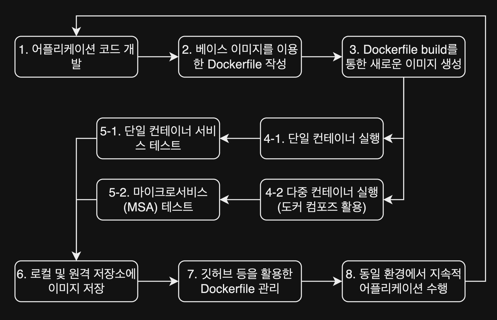

## 이미지 생성

이미지를 생성하는 방식은 2가지가 있다. 도커를 사용할 준비가 되었으니 이제 활용을 해보자

이미지와 관련된 자주쓰는 커멘드는 아래와 같다. 

| **명령어** | **설명** |
| --- | --- |
| **`docker images`** | 로컬 이미지 목록 확인. |
| **`docker pull`** | 도커 허브에서 이미지 다운로드. |
| **`docker push`** | 도커 허브로 이미지 업로드. |
| **`docker build`** | Dockerfile로 이미지 생성. |
| **`docker tag`** | 이미지 태그를 새로 추가. |
| **`docker rmi`** | 이미지 삭제. |
| **`docker save`** / **`docker load`** | 이미지를 파일로 저장/불러오기. |
| **`docker image prune`** | 사용되지 않는 이미지 삭제. |

### 기존 컨테이너를 이미지로 변환

첫 번째 방식은 컨테이너로 이미지를 만드는 방식이다. 이는 기존 컨테이너를 복제하거나 이동해야 할 때 사용한다

```powershell
docker commit "컨테이너_이름" "새로운_이미지_이름"
```

docker commit의 경우 간단한 명령어이지만 이는 이미지 생성 과정이 명시적이지 않아 유지보수가 어렵다는 단점이 있어 번거롭지만 도커 파일을 작성하여 이미지를 생성하는 것이 더 좋다. 

### 도커 스크립트로 이미지 생성

두번째 방식은 dockerfile 스크립트를 작성하여 이를 빌드해 이미지를 만드는 것이다. 이 스크립트안에는 토대가 될 이미지나 실행할 명령어 등을 작성하면 된다. 파일의 위치는 이미지 재료가 들어있는 폴더에 있으면 된다.(위치 무관)

```powershell
docker build -t "생성할_이미지_이름" "도커파일 경로"
```

도커 파일안에 들어가는 인스트럭션들을 아래와 같다

| **인스트럭션** | **설명** |
| --- | --- |
| **FROM** | 베이스 이미지 지정. Dockerfile은 항상 이 인스트럭션으로 시작해야 함. |
| **RUN** | 컨테이너 빌드 과정에서 명령어를 실행. |
| **CMD** | 컨테이너가 실행될 때 기본으로 실행될 명령어를 설정. |
| **ENTRYPOINT** | 컨테이너가 실행될 때 기본으로 실행될 명령어를 설정. CMD와 조합하여 유연하게 사용 가능. |
| **COPY** | 호스트 머신의 파일/디렉토리를 이미지에 복사. |
| **ADD** | COPY와 유사하지만, URL에서 파일을 다운로드하거나 압축 파일을 해제할 수 있음. |
| **WORKDIR** | 컨테이너 내부에서 작업 디렉토리를 설정. |
| **ENV** | 환경 변수를 설정. |
| **EXPOSE** | 컨테이너에서 사용할 네트워크 포트를 지정(단순 명시, 실제 포트 맵핑은 **`docker run -p`**로 설정). |
| **VOLUME** | 컨테이너에서 데이터를 저장할 디렉토리를 설정(호스트와 데이터 공유 가능). |
| **ARG** | 빌드 시점에 전달할 변수를 정의. |
| **LABEL** | 이미지에 메타데이터를 추가. |
| **USER** | 컨테이너 내에서 명령어를 실행할 사용자를 지정. |
| **ONBUILD** | 부모 이미지에서 후속 작업을 정의. |
| **SHELL** | RUN, CMD 또는 ENTRYPOINT에서 사용할 기본 셸을 지정. |

아래는 위 인스트럭션을 바탕으로 예시로 작성한 도커파일예시이다.

```tsx
#Python Flask 예시  

# Base image 설정 (Python 3.9)
FROM python:3.9-slim

# 작업 디렉토리 생성 및 설정
WORKDIR /app

# 의존성 파일 복사 및 설치
COPY requirements.txt .
RUN pip install --no-cache-dir -r requirements.txt

# 애플리케이션 코드 복사
COPY app.py .

# 컨테이너 시작 시 실행할 명령어
CMD ["python", "app.py"]

###########################################################################

#Node.js 예시  

# Base image 설정
FROM node:14

# 작업 디렉토리 설정
WORKDIR /usr/src/app

# 의존성 복사 및 설치
COPY package*.json ./
RUN npm install

# 애플리케이션 복사
COPY . .

# 포트 노출
EXPOSE 3000

# 실행 명령어 설정
CMD ["node", "server.js"]

```

## 컨테이너 생애주기

이미지를 토대로 컨테이너를 생성, 실행하고 삭제해보자. 

앞서 도커를 사용하기 위한 도커 데스크톱을 설치했다면 도커엔진을 이용해 컨테이너를 실행시킬 수 있게 된다. 도케 데스크톱의 경우 도커 엔진을 자동으로 실행시키지만 도커 엔진 위에 컨테이너는 도커엔진이 한번 정지되면 모든 컨테이너는 정지 상태가 된다. 

이는 서비스의 심각한 마비를 뜻하기 때문에 서버에 문제가 생겨 재가동을 하는 경우에도 컨테이너가 자동 복구되도록 추가 프로그램을 작성해야한다. 

컨테이너는 도커 명령어를 바탕으로 실행된다. 

### 컨테이너 조작 관련 커멘드

1. 컨테이너 생성 및 실행
    
    ```powershell
    docker run [OPTIONS] <이미지 이름>
    ```
    
    **주요 옵션**
    
    | **옵션** | **설명** |
    | --- | --- |
    | **`-d`** | 컨테이너를 백그라운드에서 실행. |
    | **`--name <이름>`** | 컨테이너 이름을 지정. |
    | **`-p <호스트 포트>:<컨테이너 포트>`** | 호스트와 컨테이너 간 포트를 매핑. |
    | **`-v <호스트 경로>:<컨테이너 경로>`** | 호스트와 컨테이너 간 디렉터리를 공유. |
2. 실행중인 컨테이너 확인
    
    ```powershell
    docker ps -a #실행 중이지 않은 모든 컨테이너도 표시
    ```
    
3. 컨테이너 시작 및 재시작
    
    ```powershell
    docker start <컨테이너 ID 또는 이름>
    docker restart <컨테이너 ID 또는 이름>
    ```
    
4. 컨테이너 정지 및 종료
    
    ```powershell
    docker stop <컨테이너 ID 또는 이름>
    docker kill <컨테이너 ID 또는 이름> #컨테이너 강제 종료
    ```
    
5. 컨테이너 삭제
    
    ```powershell
    docker rm <컨테이너 ID 또는 이름>
    docker rm -f <컨테이너 ID 또는 이름> # 실행중이던 컨테이너 강제 삭제
    ```

## 도커를 이용한 컨테이너 어플리케이션 개발 진행과정

<p style="color:gray; display:flex; flex-direction: column">
  
  <sapn>도커 기반 어플리케이션 개발의 라이프사이클</sapn>
</p> 

### 1. 어플리케이션 코드 개발

- 어플리케이션의 핵심 로직 및 웹 화면 구성등을 위한 코드를 개발한다.

### 2. 베이스 이미지를 이용한 Dockerfile 작성

- 개발에 필요한 인프라 구성요소를 Dockerfile에 작성한다.
- 즉, 도커허브를 통해 베이스 이미지를 다운로드하고 다양한 구동명령어(FROM, RUN, ENV, ADD, ENDPOINT 등)와 `단계1`에서 작성한 어플리케이션 코드, 라이브러리 여러 도구를 Dockerfile에 포함시킨다.
    - 베이스 이미지(FROM)
    - 실행 명령어(RUN)
    - 환경 변수(ENV)
    - 파일 추가(ADD)
    - 엔트리 포인트(ENDPOINT) 등

### 3. Dockerfile build를 통한 새로운 이미지 생성

- `docker build` 명령어를 통해 작성한 Dockerfile을 실행한다.
- 각 단계별로 실행되는 로그를 화면에서 확인가능하며, 오류 발생내용도 확인할 수 있다.

### 4. 생성된 이미지 실행

#### 4-1 단일 컨테이너 실행

- `docker image` 명령어를 통해 생성된 이미지를 확인하고 이미지를 통한 컨테이너를 구동(`docker run`)한다.

#### 4-2 다중 컨테이너 실행 (도커 컴포즈 활용)

- 도커 실행옵션을 미리 작성한 docker-compose.yml을 통해 다중컨테이너 간 실행순서, 네트워크, 의존성 등을 통합관리 할 수 있고 MSA(마이크로 서비스 개발)에 활용한다.

### 5. 어플리케이션 서비스 테스트

#### 5-1 단일 컨테이너 서비스 테스트

- 예를들어, Nginx를 이용한 웹 애플리케이션 컨테이너 서비스였다면 연결하는 IP와 포트 번호를 이용하여 웹 브라우저를 이용한 페이지 연결을 확인할 수 있다.

#### 5-2 마이크로서비스(MSA) 테스트

- 다중 컨테이너 간 상호작용 및 기능 테스트를 수행한다.

### 6. 로컬 및 원격 저장소에 이미지 저장

- **저장소**
    - 로컬 저장소(도커 서버, 프라이빗 레포지토리)
    - 원격 저장소(도커 허브)
- **목적:** 팀 간의 공유 및 지속적인 이미지 관리를 수행한다.

### 7. 깃허브 등을 활용한 Dockerfile 관리

- Dockerfile 코드를 깃허브에 저장 및 관리할 수 있고, 도커허브 사이트와 연동하면 자동화된 빌드 기능을 이용한 이미지 생성도 가능하다.

### 8. 동일 환경에서 지속적 어플리케이션 수행

- `단계1~7` 과정을 통해 업무용 어플리케이션 이미지를 지속적으로 개발, 운영 및 관리를 할 수 있다.